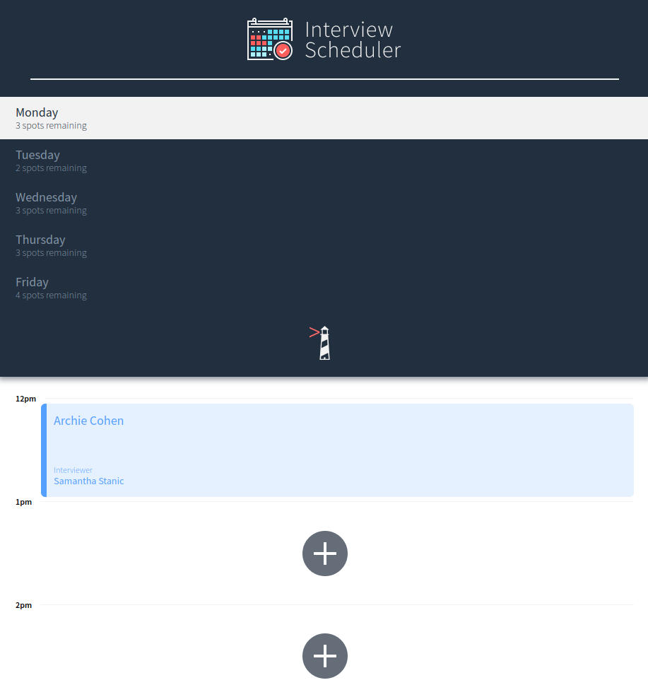
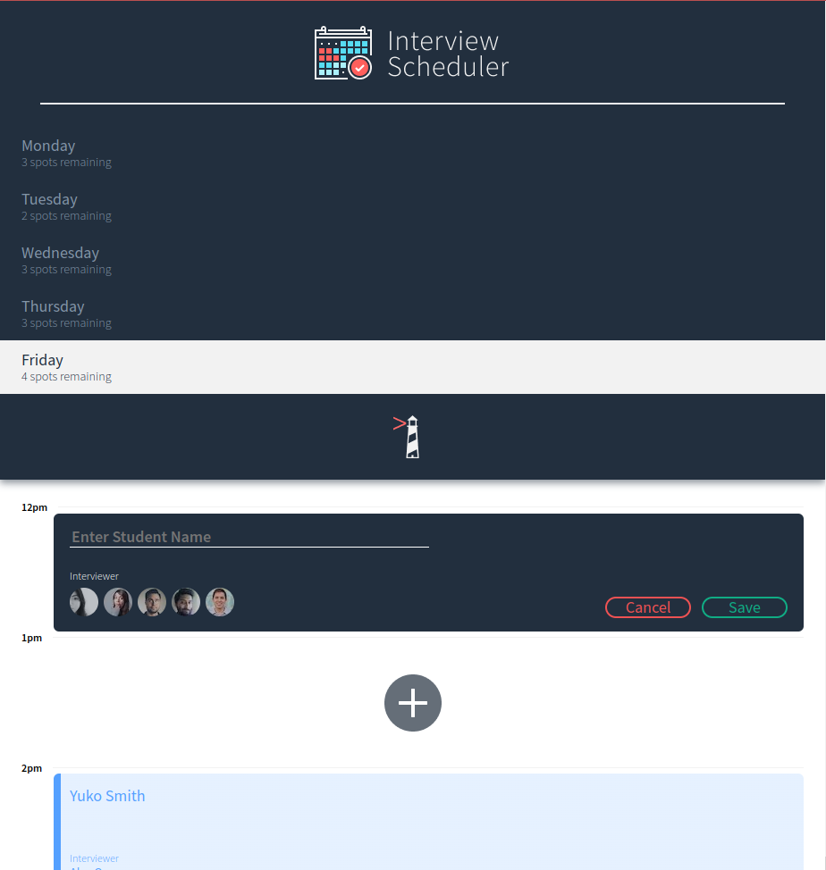
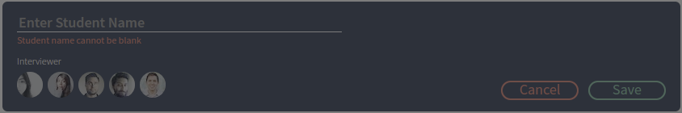
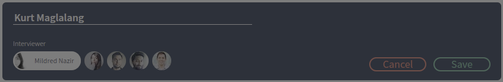
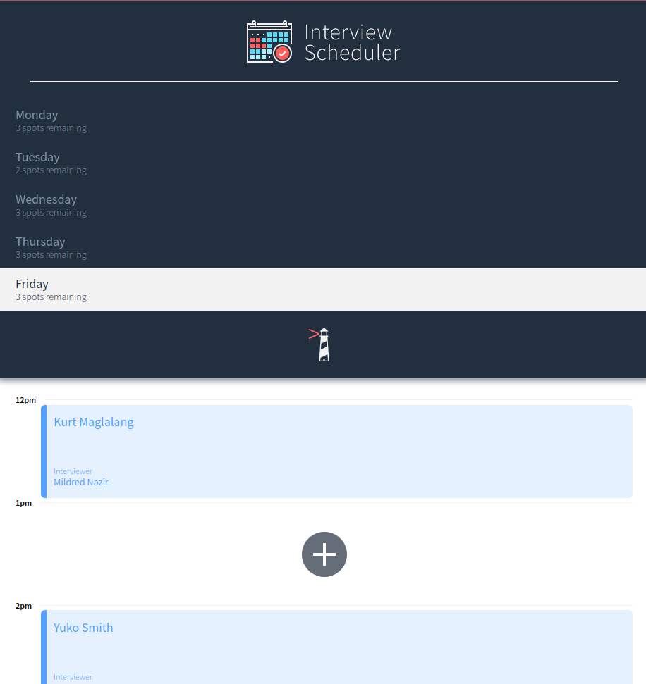
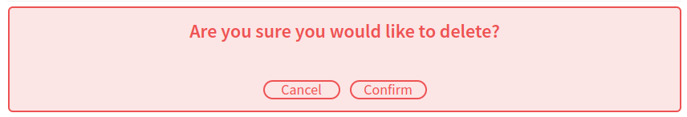
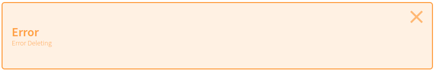

# Interview Scheduler

Using the latest tools and techniques, we build and test a React application that allows users to book and cancel interviews.

# Screenshots












# Dependencies

- axios: ^0.26.1
- classnames: ^2.2.6
- eslint: ^5.16.0
- normalize.css: ^8.0.1
- react: ^16.9.0
- react-dom: ^16.9.0
- react-scripts: 3.0.0

# Development Dependencies

- @babel/core: ^7.4.3
- @storybook/addon-actions: ^5.0.10
- @storybook/addon-backgrounds: ^5.0.10
- @storybook/addon-links: ^5.0.10
- @storybook/addons: ^5.0.10
- @storybook/react: ^5.0.10
- @testing-library/jest-dom: ^4.0.0
- @testing-library/react: ^8.0.7
- @testing-library/react-hooks: ^8.0.0
- babel-loader: ^8.0.5
- node-sass: ^4.14.0
- prop-types: ^15.8.1
- react-test-renderer: ^16.9.0

# Getting Started

1. Clone this repository onto your local device.
2. Install dependencies using the `npm install` command.
3. Clone the [scheduler-api](https://github.com/KBMaglalang/scheduler-api) and follow the instructions to setup the psql database.
4. Start the database web server (scheduler-api) using the `npm start` command.
5. Start the interview scheduler server (scheduler) using the `npm start` command.
6. Go to <http://localhost:8000/> in your browser.

# Scheduler Commands

## Running Webpack Development Server

```sh
npm start
```

## Running Jest Test Framework

```sh
npm test
```

## Running Storybook Visual Testbed

```sh
npm run storybook
```
